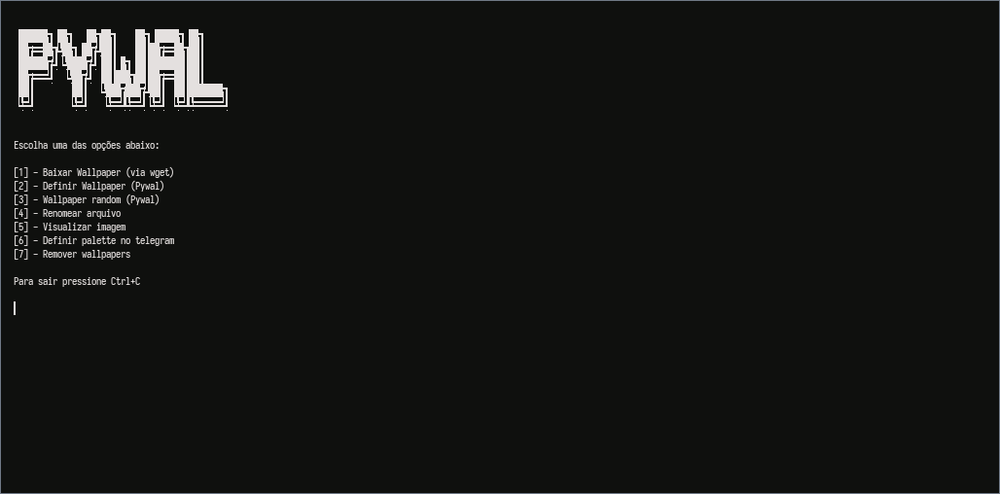

# Pywal Installer
Script baseado no [pywal](https://github.com/dylanaraps/pywal)

# Deps:
- [fzf](https://github.com/junegunn/fzf)
- [pywal](https://github.com/dylanaraps/pywal)
- [Telegram-gen pywal](https://github.com/agnipau/telegram-palette-gen)

### Pywal Arch Linux
Pacman:
```
sudo pacman -S python-pywal
```

Pip:
```
pip install --user pywal
```

#### Pywal



# OBS:
```
Para você usar o Wallpaper random, você precisa baixar o script random_pywal e jogar no seu $HOME/.local/bin
```

# Pack Wallapapers
```
Caso você queira o meu Pack de wallpapers só copiar e executar o comando abaixo no seu terminal:

wget -c "https://raw.githubusercontent.com/ffraanks/pywal-installer/master/wallpapers" && chmod +x wallpapers && ./wallpapers
```

# Script install and execute:
```
cd $HOME/.local/bin && wget -c "https://github.com/ffraanks/pywal-installer/raw/master/pywal" && chmod +x pywal && cd $HOME/.local/bin && wget -c "https://raw.githubusercontent.com/ffraanks/pywal-installer/master/random_pywal" && chmod +x random_pywal && cd $HOME/.local/bin && ./pywal
```
