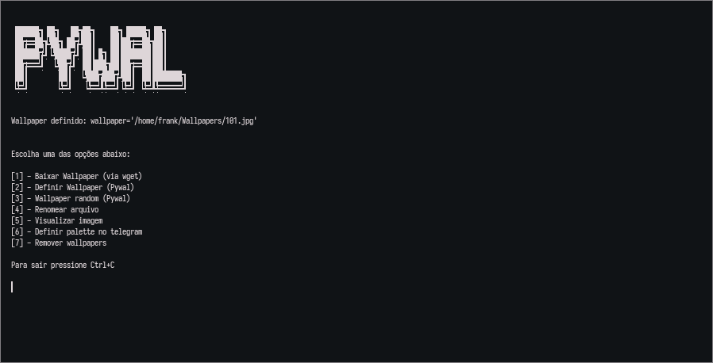

# Pywal Installer
Script baseado no [pywal](https://github.com/dylanaraps/pywal)

# Deps:
- [fzf](https://github.com/junegunn/fzf)
- [pywal](https://github.com/dylanaraps/pywal)
- [Telegram-gen pywal](https://github.com/agnipau/telegram-palette-gen)

### Pywal Arch Linux
Pacman:
```
sudo pacman -S python-pywal
```

Pip:
```
pip install --user pywal
```

#### Pywal



## Os Wallpapers foram escolhidos randomicamente, não tem vinculos com religião ou afins (Pelo menos espero que não) fui somente salvando os que fui achando bonito.

## Pack Wallapapers

# O script para automatizar o download está sendo analisado!!!

# Baixar manualmente:

[Pack Wallpapers](https://www.4shared.com/get/eaD0DSBuea/Pack_Wallpaperstar.html)

# Script install and execute:
```
cd $HOME/.local/bin && wget -c "https://github.com/ffraanks/pywal-installer/raw/master/pywal" && chmod +x pywal && cd $HOME/.local/bin && ./pywal
```
